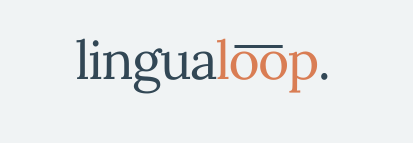
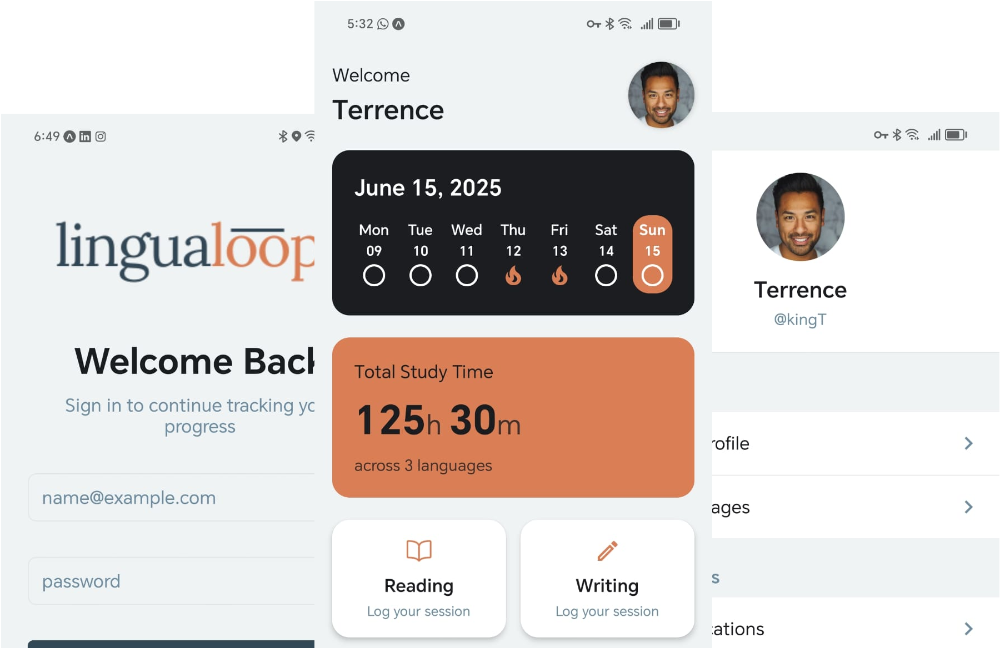

 

# LinguaLoop

**LinguaLoop** is an open-source, goal-driven language learning tracker.
It helps you stay motivated and organized by letting you set language goals, track your daily activities, visualize your progress, and connect with other learners.
Built with React Native, Expo, and Supabase, LinguaLoop is designed for both casual learners and serious polyglots.

[](https://supabase.com) 

---

## App Screenshot

<p align="center">
  
</p>

---

## Features

- 📈 **Track your language learning**: Log activities like reading, writing, listening, and speaking for each language you're learning.
- 🎯 **Set and achieve goals**: Define custom goals and milestones for your language journey.
- 🏆 **Achievements & streaks**: Stay motivated with streaks, achievements, and progress cards.
- 👥 **Connections**: Follow other learners, view their profiles, and celebrate their progress.
- 🔔 **Push notifications**: Get reminders and motivational nudges to keep you on track.
- 📊 **Reports & insights**: Visualize your study time, activity distribution, and progress over time.
- 🌐 **Multi-language support**: Track multiple languages, each with its own proficiency level.

---

## Roadmap

Want to see what's coming next or suggest a feature?
Check out our public roadmap on Trello:
[https://trello.com/b/MpwbSoZP/lingualoop-roadmap](https://trello.com/b/MpwbSoZP/lingualoop-roadmap)

---

## Tech Stack

- **React Native** (with [Expo](https://expo.dev)) for cross-platform mobile development
- **Supabase** for authentication, database, and storage
- **TypeScript** for type safety
- **Expo Router** for file-based navigation
- **Custom hooks** for data fetching and state management

---

## Getting Started

### 1. Clone the repository

```bash
git clone https://github.com/yourusername/lingualoop.git
cd lingualoop
```

### 2. Install dependencies

```bash
npm install
```

### 3. Set up environment variables

Copy `.env.example` to `.env` and fill in your Supabase credentials and any other required secrets.

### 4. Start the app

```bash
npx expo start
```

You can run the app on:
- A physical device (with Expo Go)
- Android emulator
- iOS simulator
- Web browser

---

## Contributing

Contributions are welcome! Please open an issue or pull request for bug fixes, new features, or improvements.

1. Fork the repo and create your branch from `main`
2. Make your changes and add tests if applicable
3. Open a pull request and describe your changes

---

## License

This project is licensed under the MIT License.

---

[](https://forthebadge.com)